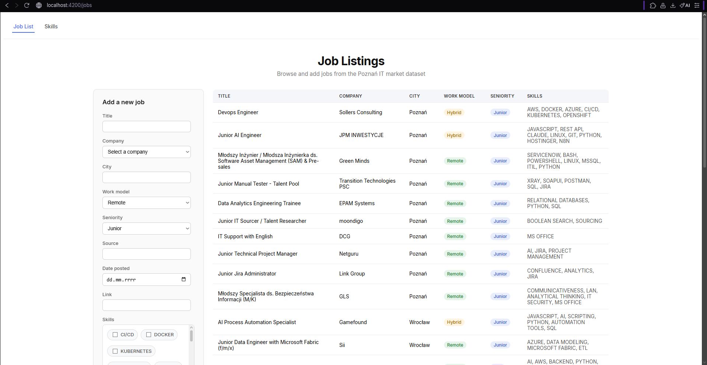
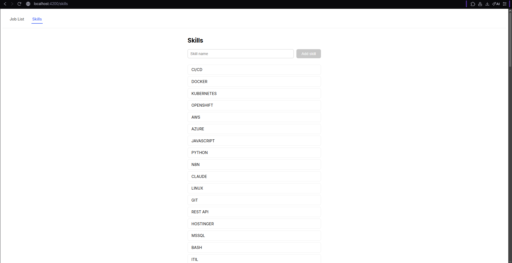
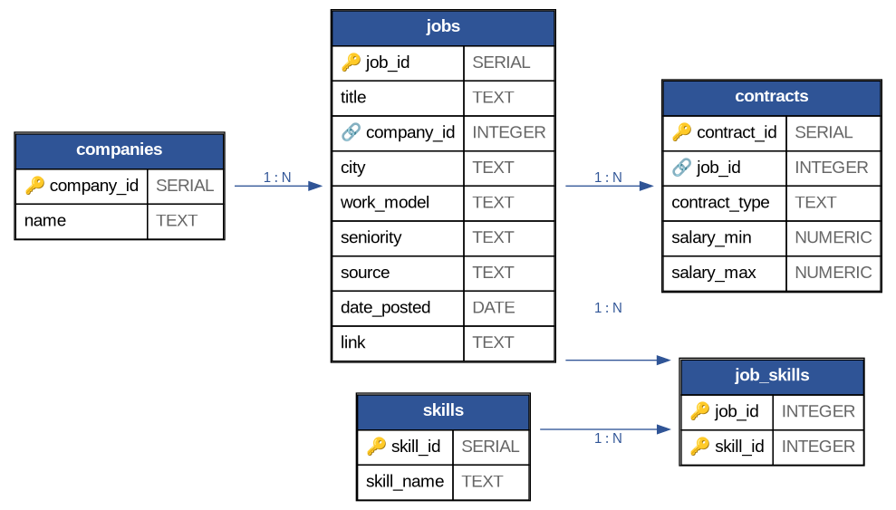
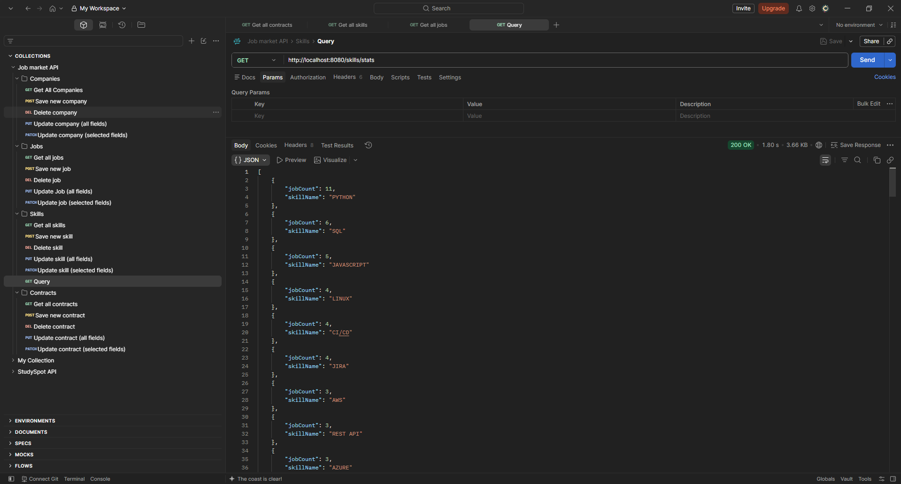
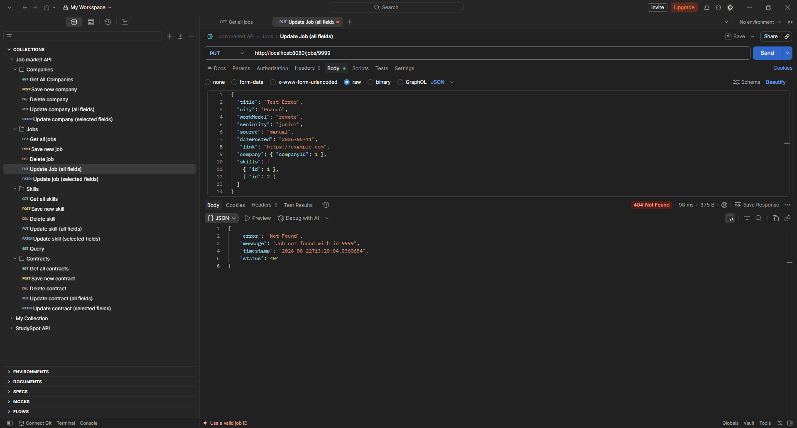

# Job Market API

[](https://github.com/mateateatea/job-market-api/actions/workflows/tests.yml)

A full-stack portfolio project built around an existing PostgreSQL job-market dataset, with a strong focus on testing and debugging. It combines a Spring Boot REST API, an Angular frontend, manual API checks, 27 backend unit tests, and a GitHub Actions workflow.

The database comes from my earlier [Polish IT Job Market SQL](https://github.com/mateateatea/polish-it-job-market-sql) project. This repository adds an application layer for working with its companies, jobs, skills, and contracts through HTTP instead of direct database access.



## What is included

### Backend

- CRUD endpoints for companies, jobs, skills, and contracts.
- Separate `PATCH` endpoints for partial updates.
- Controller → service → repository architecture with constructor injection.
- JPA mappings for `Job → Company`, `Contract → Job`, and `Job ↔ Skill` through `job_skills`.
- `GET /skills/stats`, using a native SQL `GROUP BY` and `COUNT` query through a `SkillStat` projection.
- Central error handling for missing resources (`404`) and invalid references (`400`).
- PostgreSQL credentials stored in a gitignored properties file with a committed example.
- CORS configuration for the Angular development server at `localhost:4200`.

### Frontend

- `/jobs`: job table and reactive add-job form.
- `/skills`: skill list and reactive add-skill form.
- Angular Router navigation, with the empty path redirecting to `/jobs`.
- Company and skill options loaded from the backend.
- Skill checkbox chips plus work-model and seniority dropdowns.
- Angular Signals for list state and reliable updates after asynchronous HTTP requests.
- Automatic list refresh after a successful create request.



## Tech stack

| Area | Technology |
| --- | --- |
| Backend | Java (target 21), Spring Boot 4.1.0, Spring Web MVC |
| Persistence | Spring Data JPA, Hibernate, PostgreSQL |
| Build | Maven Wrapper |
| Backend testing | JUnit 5, Mockito |
| Manual API testing | Postman |
| Frontend | Angular 22.1, TypeScript 6.0, RxJS 7.8, Reactive Forms |
| CI | GitHub Actions, Temurin JDK 25 |

The project was developed with JDK 25 and the CI workflow uses JDK 25; Maven compiles against Java 21.

## Database model

The API maps onto the existing `companies`, `jobs`, `skills`, `job_skills`, and `contracts` tables created in the companion SQL project. Hibernate schema generation is disabled, so the database structure remains managed outside this application.



## API endpoints

The backend runs at `http://localhost:8080` by default.

| Resource | Supported endpoints |
| --- | --- |
| Jobs | `GET /jobs`, `GET /jobs/{id}`, `POST /jobs`, `PUT /jobs/{id}`, `PATCH /jobs/{id}`, `DELETE /jobs/{id}` |
| Companies | `GET /companies`, `GET /companies/{id}`, `POST /companies`, `PUT /companies/{id}`, `PATCH /companies/{id}`, `DELETE /companies/{id}` |
| Skills | `GET /skills`, `GET /skills/{id}`, `POST /skills`, `PUT /skills/{id}`, `PATCH /skills/{id}`, `DELETE /skills/{id}` |
| Contracts | `GET /contracts`, `GET /contracts/{id}`, `POST /contracts`, `PUT /contracts/{id}`, `PATCH /contracts/{id}`, `DELETE /contracts/{id}` |
| Skill statistics | `GET /skills/stats` |

## QA approach

The project was developed in short iterations:

1. Map the existing database tables with JPA entities.
2. Add one API resource at a time and exercise it in Postman against real data.
3. Check relationship persistence and negative responses.
4. Move logic from controllers into services.
5. Automate service behavior with JUnit and Mockito.
6. Run the database-independent test suite in GitHub Actions.
7. Exercise the API end to end through the Angular frontend.

### Manual checks

The checks recorded during development covered:

- Job CRUD flows.
- Contract CRUD flows.
- Reading and writing the job-skill relationship.
- The `/skills/stats` aggregation response.
- Structured `404` responses for missing IDs.
- `400` responses for invalid foreign-key references.
- A fresh `GET` after relationship updates when the immediate update response contained stale object data.
- Successful job and skill creation through the frontend, including list refresh after the response.
- Repeated page refreshes to confirm reliable job-table rendering.



### Automated tests

The backend contains **27 database-independent service tests** using JUnit 5 and Mockito:

| Test class | Tests | Main coverage |
| --- | ---: | --- |
| `CompanyServiceTest` | 7 | Found/not found, create, update, patch, delete |
| `ContractServiceTest` | 6 | Found/not found, create, update, patch, delete |
| `JobServiceTest` | 7 | Found/not found, create, relationships, update, patch, delete |
| `SkillServiceTest` | 7 | Found/not found, create, update, patch, delete |

Repository dependencies are mocked, so the tests do not change real database data.

The `Tests` GitHub Actions workflow runs this suite on every push and pull request to `main`. The generated Spring context-load test is excluded because it requires a configured PostgreSQL datasource, which the CI runner does not provide.



From `backend/`, run the same database-independent suite used by CI:

```bash
./mvnw test -Dtest='!JobMarketApiApplicationTests'
```

On Windows PowerShell, use `.\mvnw.cmd test "-Dtest=!JobMarketApiApplicationTests"`.

## Bugs investigated during development

| Issue | Cause | Resolution |
| --- | --- | --- |
| Jobs table stayed empty despite a valid API response | Angular change-detection timing around asynchronous data | Stored the list in an Angular Signal so the view updates reliably |
| Salary assertions failed for equivalent values | `BigDecimal.equals()` treats `9000` and `9000.00` as different because their scales differ | Compared salary values with `compareTo()` |
| A newly created skill did not appear immediately | The refresh happened before the HTTP request completed | Moved the refresh into the success callback |
| Maven Wrapper failed in GitHub Actions | The Linux runner did not have execute permission | Added `chmod +x mvnw` before the test step |
| CI test exclusion did not take effect | The Maven flag had been placed on the wrong workflow step | Moved the flag to the test command |
| Test and payload mistakes around identifiers | `Job` and `Company` use `jobId`/`companyId`, while `Skill` uses `id` | Updated the tests and payloads to match the current entities; consistency remains a refactoring point |

## Run locally

### Prerequisites

- PostgreSQL running on `localhost:5432`.
- The `job_market` database created and populated using the companion [SQL project](https://github.com/mateateatea/polish-it-job-market-sql).
- JDK 25 to match the development and CI environment.
- Node.js and npm. The repository records npm 11.17.0 as its package manager.

Hibernate schema generation is disabled with `spring.jpa.hibernate.ddl-auto=none`; this application expects the database tables to exist already.

### Backend

Clone the repository and create the local secret file:

```bash
git clone https://github.com/mateateatea/job-market-api.git
cd job-market-api/backend
cp src/main/resources/application-secret.properties.example src/main/resources/application-secret.properties
```

On Windows PowerShell, use this copy command instead:

```powershell
Copy-Item src/main/resources/application-secret.properties.example src/main/resources/application-secret.properties
```

Set your PostgreSQL password in `application-secret.properties`. The committed configuration expects the `postgres` user and the `job_market` database.

Start the backend:

```bash
./mvnw spring-boot:run
```

On Windows, use `.\mvnw.cmd spring-boot:run`.

### Frontend

In another terminal, from the repository root:

```bash
cd frontend
npm ci
npm start
```

Open `http://localhost:4200`.